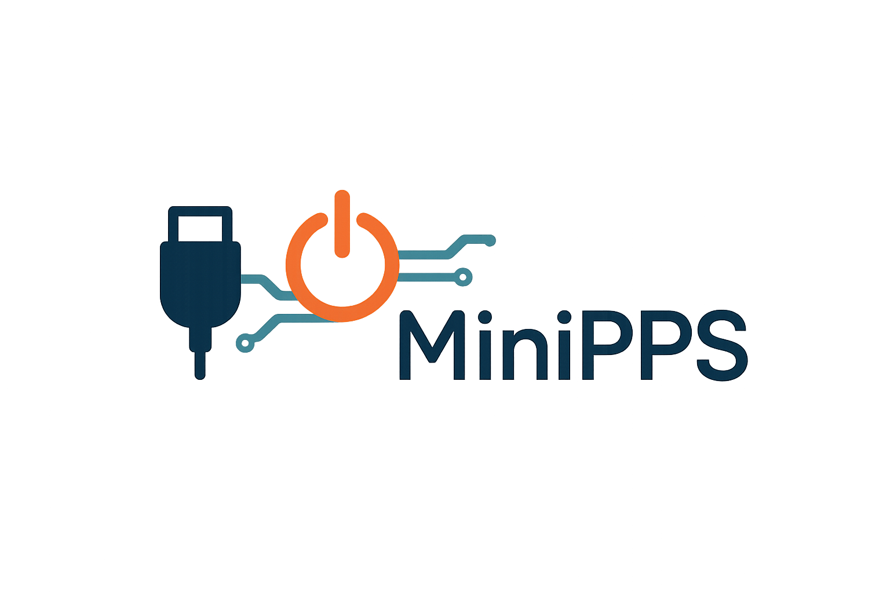
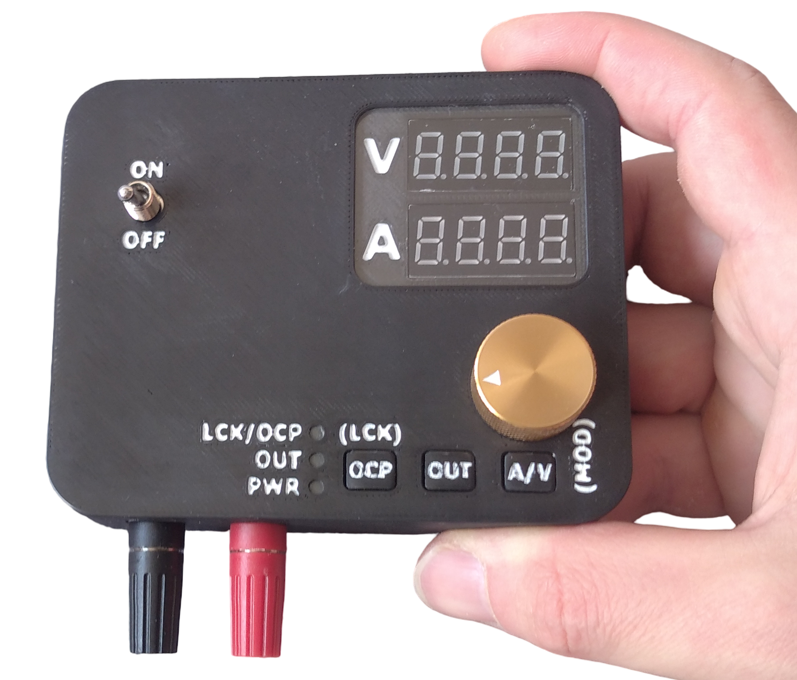
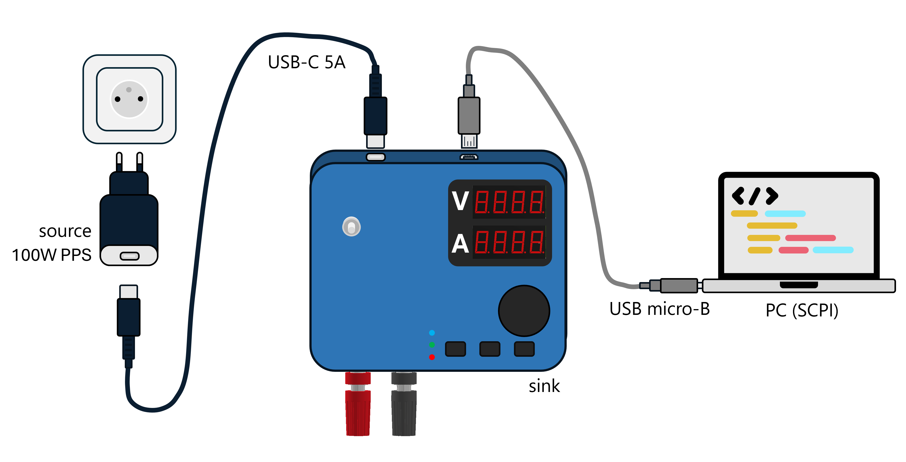

# Power Supply Sink Application

To learn more about text formatting see: [Writing-on-GitHub](https://docs.github.com/en/get-started/writing-on-github/getting-started-with-writing-and-formatting-on-github/basic-writing-and-formatting-syntax)

**demo-nucleo-v0**: Basic application for Nucleo-G0B1RE + SNK1M1 based on AN5418  
**demo-nucleo-v0.1**: USB PD app for Nucleo-G0B1RE + SNK1M1 with button-triggered APDO request  
**demo-cb-v0.1**: Demo for custom board derived from demo-nucleo-v0.1 (features APDO requests)

---

# [MiniPPS](https://yourprojectpage.dev/)  
*A USB-C Programmable Power Supply with Adjustable Voltage/Current and Digital Control*

<!-- --> 
  

---

## 📖 Table of Contents

- [Power Supply Sink Application](#power-supply-sink-application)
- [MiniPPS](#minipps)
  - [📖 Table of Contents](#-table-of-contents)
  - [🧠 About](#-about)
  - [⚙️ Features](#️-features)
    - [✅ Hardware](#-hardware)
    - [🎛️ User Interface](#️-user-interface)
    - [💻 Software](#-software)
  - [📐 Design Details](#-design-details)
    - [🔌 Schematic Overview](#-schematic-overview)
    - [🔒 Protections](#-protections)
  - [📊 Measured Performance](#-measured-performance)
  - [🛠️ Building the Project](#️-building-the-project)
  - [🚀 How to Use](#-how-to-use)
  - [🔮 Future Plans](#-future-plans)
  - [📄 License](#-license)
  - [🙏 Acknowledgments](#-acknowledgments)

---

## 🧠 About

MiniPPS is a compact, USB-C Programmable Power Supply designed to deliver **3.3V–21V**, up to **5A**, with **precision control** via buttons and an encoder. It supports USB PD 3.0 and PPS profiles and includes current sensing, SCPI command support, and optional remote control.

Ideal for embedded developers, hobbyists, and electronics students seeking a compact, user-friendly bench power supply.

<kbd></kbd>

---

## ⚙️ Features

### ✅ Hardware

- **USB-C PD Sink** supporting up to 100W (PD 3.0 + PPS)
- **TCPP01-M12** protection and **STM32G0B1RE** MCU
- **High-accuracy current sensing** (MCP6C02)
- Output switching (relay-based)
- **20mV / 1mA adjustment resolution**
- Dual 7-segment displays with MAX7219
- Optional UART interface for debugging with UCPMonitor
- Compact 4-layer PCB KiCad design

### 🎛️ User Interface

- Rotary encoder for setpoint control
- Three tactile buttons:
  - OUT on/off
  - OCP on/off + lock/unlock (long press)
  - Voltage/current + set mode (long press Fixed/PPS)
- Dual 7-segment LED display:
  - Real-time voltage/current
  - Set values display

### 💻 Software

- STM32 HAL + STM32CubeIDE (FreeRTOS optional)
- PID or step-based DAC/PWM voltage control
- Button debouncing, encoder 
- PD contract negotiation (APDO requests)
- SCPI protocol via USB for host communication with PC

---

## 📐 Design Details

### 🔌 Schematic Overview

<kbd></kbd>

### 🔒 Protections

- Reverse voltage protection (Schottky diodes)
- Overcurrent protection (OCP) (MCP6C02 + AWDG/INA301 + alert) 
- Output controlled with relay
- OTP and OVP protections built into hardware (TCPP01-M12)

---

## 📊 Measured Performance

| Parameter                            | Value / Range                             |
|-------------------------------------|-------------------------------------------|
| Output Voltage Range                | 3.3V – 21V (depending on adapter)         |
| Output Current Range                | 0 – 5A                                     |
| Max Output Power                    | 100W                                       |
| Voltage Set Resolution              | 20 mV                                      |
| Current Set Resolution              | 1 mA                                       |
| Display Resolution (Voltage/Current)| 10 mV / 1 mA                               |
| Output Voltage Ripple (20 Hz–20 MHz)| 70–314 mVpp (depending on adapter)         |
| Load Step Response Time             | 0.6–21.4 ms (depending on adapter)         |
| Rise/Fall Time (10–90%)             | 32–428 μs                                  |
| Voltage Accuracy (after calibration)| ±14 mV                                     |
| Current Accuracy (after calibration)| ±4 mA                                      |
| Protections                         | OVP (22V), OCP, OTP (145°C), ESD          |
| Communication                       | USB Micro-B, custom SCPI protocol         |
| Cooling                             | Passive (no fan)                           |
| Max Case Temperature @ Full Load    | ~80°C (relay-based build)                 |
| Dimensions                          | 106 x 86 x 26 mm                           |
| Weight                              | 162 g                                      |

---

## 🛠️ Building the Project

1. Download PCB Gerbers from `/hardware`
2. Order from a fab (e.g. [PCBWay](https://www.pcbway.com))
3. Assemble and solder components as per BOM
4. Flash firmware via ST-Link or Nucleo-G0B1RE
5. Connect USB-C PD source (charger or trigger)
6. Connect load and test via 4 mm banana terminals

See [Wiki – Assembly Guide](https://github.com/youruser/SmartPPS/wiki/Assembly-Guide) for details.

---

## 🚀 How to Use

1. Power the device using a USB-C PD charger or powerbank
2. Push encoder and select desired voltage or current
3. Press A/V to switch between settings
4. Press `Output ON/OFF` to enable the output
5. Monitor live output on the 7-segment display
6. Use `Lock` button to freeze or protect settings
7. Long press A/V button to switch between Fixed/PPS mode
8. Optionaly connect USB Micro-B to PC, open COM port and control via commands

<kbd></kbd>

---

## 🔮 Future Plans

- USB PD 3.2 support (up to 48V / 5A)
- SCPI improvements and remote GUI (Qt/Python)
- Active cooling option
- Auto-ranging voltage dividers for better ADC precision
- Setting retention via emulated EEPROM

Track progress here: [GitHub Projects](https://github.com/users/youruser/projects/1)

---

## 📄 License

<!-- MIT License. See [LICENSE](LICENSE) for full details. -->

---

## 🙏 Acknowledgments

- Thanks to [STMicroelectronics](https://www.st.com/) for their excellent documentation and hardware samples
- Inspired by Tenma and RD Tech programmable PSUs
- Uses [MAX7219](https://datasheets.maximintegrated.com/en/ds/MAX7219-MAX7221.pdf), STM32G0, and KiCad
- Developed for engineers, students, and tinkerers 🚀
<!-- TODO: Developed as master thesis with collaboration and guidance from bender robotics -->

